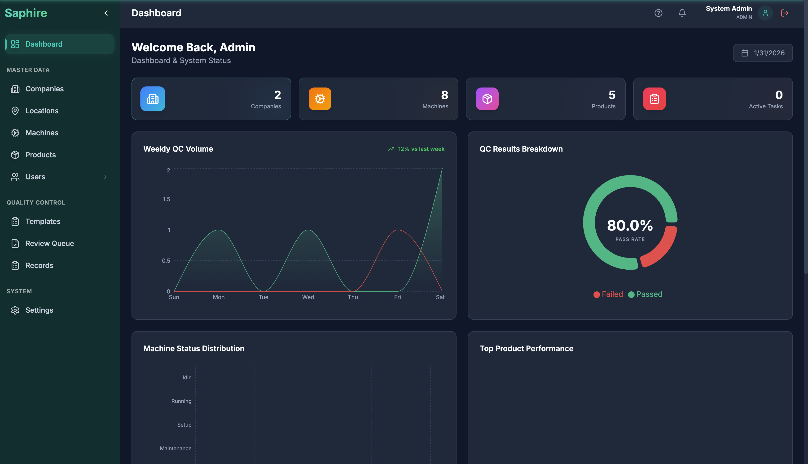
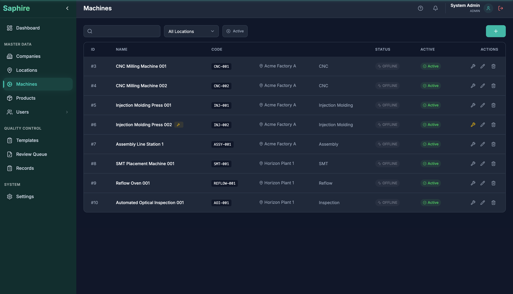
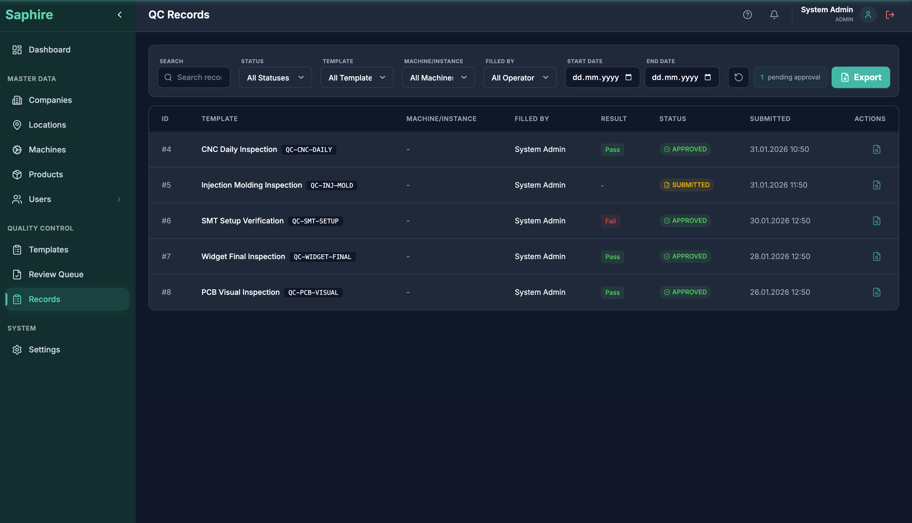
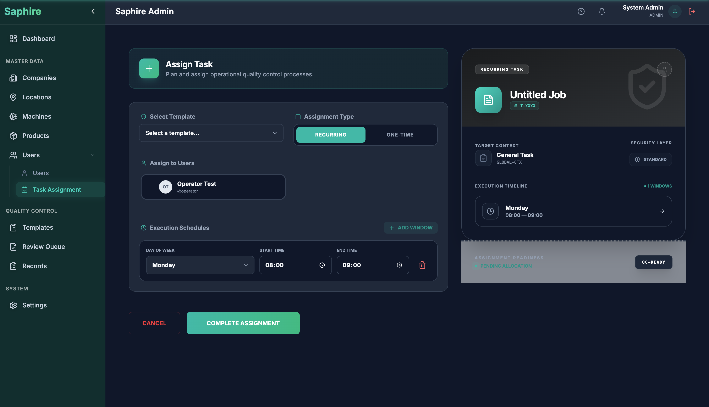
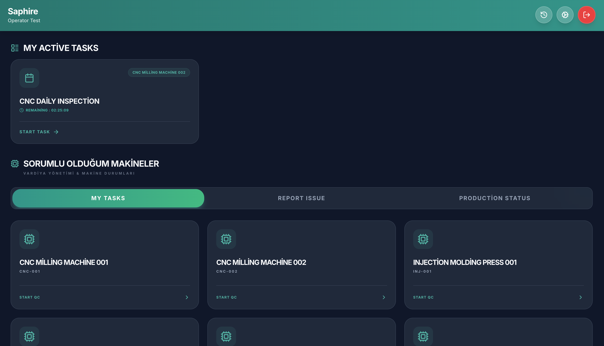
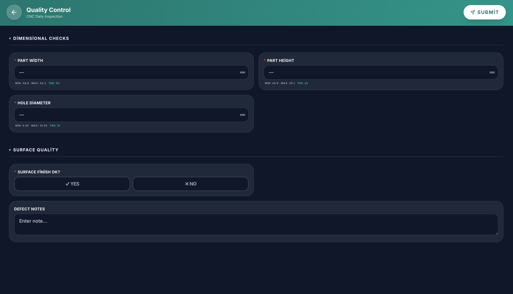
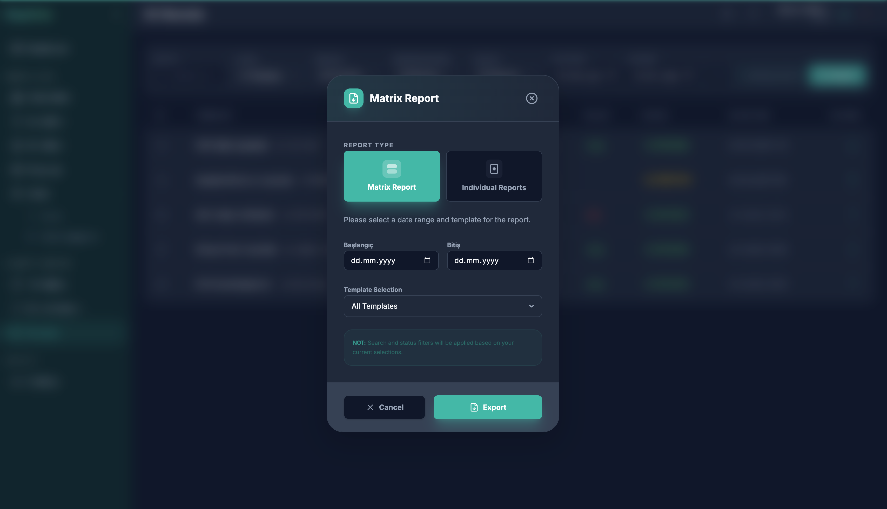

# 💎 SAPHIRE
## Industrial Quality Control & Production Monitoring System

<p align="center">
  
</p>

**Saphire** is a comprehensive, cloud-ready solution designed for modern manufacturing facilities. It enables full traceability, real-time quality control, and efficient production management from the factory floor to the executive office.

---

## 📖 Table of Contents

1.  [What is Saphire?](#-what-is-saphire)
2.  [Key Benefits](#-key-benefits)
3.  [System Architecture](#-system-architecture)
4.  [Getting Started](#-getting-started)
5.  [Admin Console Guide](#-admin-console-guide)
    *   [Dashboard](#1-dashboard)
    *   [Master Data](#2-master-data)
    *   [Quality Control](#3-quality-control)
    *   [Production](#4-production)
    *   [Task Scheduling](#5-task-scheduling)
6.  [Mobile Application Guide](#-mobile-application-guide)
7.  [Advanced Features](#-advanced-features)
8.  [Technology Stack](#-technology-stack)
9.  [License](#-license)

---

## 🎯 What is Saphire?

Saphire is a two-part system designed for industrial environments:

1.  **Admin Console (Web)**: A powerful management interface for supervisors, quality engineers, and plant managers to configure the system, design QC forms, assign tasks, and analyze records.
2.  **Mobile Application (Web/PWA)**: A touch-friendly interface for operators on the factory floor to perform assigned quality checks, log measurements, and submit records in real-time.

The goal of Saphire is to **digitize and automate quality control processes**, replacing paper-based checklists with dynamic, data-driven forms while providing full audit trails and compliance reports.

---

## ✨ Key Benefits

| Feature | Description |
| :--- | :--- |
| **Paperless Operations** | Eliminate paper checklists with digital forms on any device. |
| **Full Traceability** | Every record is timestamped and linked to the operator, machine, and product. |
| **Real-time Visibility** | Dashboards provide live stats on pass/fail rates, pending approvals, and machine status. |
| **Configurable Workflows** | Design custom QC forms and approval processes without writing code. |
| **Multi-language Support** | Built-in support for English and Turkish, with easy extensibility. |
| **Role-based Access** | Admins, Supervisors, and Operators each have tailored access levels. |

---

## 🏗️ System Architecture

Saphire follows a standard three-tier architecture:

```
┌─────────────────────┐     ┌─────────────────────┐
│   Admin Console     │     │   Mobile App        │
│   (React 19 + Vite) │     │   (React 19 + Vite) │
└──────────┬──────────┘     └──────────┬──────────┘
           │                           │
           │       HTTPS (API)         │
           └───────────┬───────────────┘
                       │
           ┌───────────▼───────────┐
           │   Backend API         │
           │   (Spring Boot)       │
           └───────────┬───────────┘
                       │
           ┌───────────▼───────────┐
           │   Database            │
           │   (PostgreSQL)        │
           └───────────────────────┘
```

---

## 🚀 Getting Started

### Prerequisites
-   Node.js (v18 or higher)
-   npm or Yarn
-   A running instance of the Saphire Backend API

### Installation

```bash
# Clone the repository
git clone https://github.com/your-username/saphire.git
cd saphire
```

### Running the Admin Console

```bash
cd Saphire-Admin_Console
npm install
npm run dev
```
> The Admin Console will be available at `http://localhost:3000`.

### Running the Mobile Application

```bash
cd Saphire-Mobile
npm install
npm run dev
```
> The Mobile App will be available at `http://localhost:3001`.

### Default Credentials
| Username | Password | Role |
| :--- | :--- | :--- |
| `admin` | `admin123` | Administrator |

---

## 📊 Admin Console Guide

The Admin Console is the central hub for all management and configuration tasks.

### 1. Dashboard

The Dashboard provides a real-time overview of your entire operation.


**Key Features:**
-   **System Status**: Live connection status for API and Database.
-   **Quick Actions**: One-click shortcuts to add Companies, Locations, Machines, Products, or Templates.
-   **QC Breakdown**: Pie chart showing pass/fail/warning ratios for all records.
-   **Weekly Volume**: Bar chart showing QC activity trends over the last week.
-   **Machine Status Distribution**: Visual breakdown of machine states (Running, Idle, Maintenance, etc.).
-   **Product Performance**: See which products have the best or worst pass rates.
-   **Critical Alerts**: Any failing records that need immediate attention.
-   **Recent Activity Feed**: Timeline of the latest actions in the system.

---

### 2. Master Data

This section allows you to configure the foundational entities that your operation depends on.

#### Companies
Create and manage multiple companies if you operate in a multi-tenant environment. Each company can have its own logo and configuration.

#### Locations
Define physical locations (e.g., Factory A, Warehouse B). Locations belong to a Company and are used to group machines.

#### Machines
Register individual machines on the factory floor. Each machine belongs to a Location and can have templates assigned to it for QC.



#### Products
Define the products your company manufactures. Products can be linked to specific QC templates and production routes.

#### Users
Manage user accounts with role-based access control.

| Role | Permissions |
| :--- | :--- |
| **Admin** | Full access to all modules, system settings, and user management. |
| **Supervisor** | Can approve/reject QC records, manage templates, and view reports. |
| **Operator** | Can only fill QC forms and view assigned tasks on the mobile app. |

---

### 3. Quality Control

This is the core of Saphire, where you design forms, review submissions, and manage approval workflows.

#### QC Templates

Templates are the backbone of your quality control process. Each template is a digital form containing one or more "Control Points".


**Creating a Template:**
1.  Click **"Add Template"**.
2.  Choose a **Context Type**:
    *   **Machine**: The template is for a specific machine (e.g., "Injection Molding Machine 1").
    *   **Product**: The template is for a specific product (e.g., "Product ABC").
    *   **Process**: The template is for a general process (e.g., "Incoming Inspection").
    *   **General**: A template not tied to any specific entity.
3.  Enter a **Template Name** and **Code**.
4.  Add **Control Points**:
    *   **Control Name**: E.g., "Part Width"
    *   **Input Type**: Choose from Number, Decimal, Pass/Fail, Yes/No, Text, Dropdown, Photo, or Signature.
    *   **Unit**: (Optional) E.g., mm, cm, kg.
    *   **Target/Min/Max Values**: Define acceptable ranges for automatic pass/fail logic.
    *   **Repeat Count**: If a control must be performed multiple times (e.g., 64 for a 64-cavity mold), set this value.
5.  Toggle **"Requires Approval"** if supervisors must approve submissions.
6.  Toggle **"Allow Partial Save"** if operators can save incomplete forms.
7.  Save the template.

#### QC Records

All submitted forms are stored as QC Records. Use the Records page to search, filter, and review all submissions.



**Filtering:**
-   **By Template**: View records for a specific template only.
-   **By Machine**: Filter by which machine the QC was performed on.
-   **By Operator**: See all records submitted by a specific user.
-   **By Date Range**: Focus on a specific time period.
-   **By Result**: Filter by "Pass", "Fail", or "Warning".

**Record Detail View:**
-   Click on any record to see the full form data.
-   View individual control point values and whether they passed or failed.
-   See the submission timestamp and the operator who submitted it.

#### Review Queue

If a template has "Requires Approval" enabled, submitted records will appear in the Review Queue.

-   **Approve**: Mark the record as verified.
-   **Reject**: Mark the record as failed and provide a reason.

---

### 4. Production

For companies that track production routes, Saphire offers:

#### Routes (Product Routes)
Define the sequence of steps a product goes through during manufacturing. Each step can have a "Setup Time" and "Cycle Time".

#### Instances (Production Instances)
Create and track individual production jobs. Each instance follows a route and can have a priority level (Normal, Medium, High).

---

### 5. Task Scheduling

This powerful module allows you to assign QC tasks to operators automatically.



**How to Assign a Task:**
1.  Click **"Assign Task"**.
2.  Select a **QC Template** (this is the form the operator will fill).
3.  Choose an **Assignment Type**:
    *   **Recurring**: The task repeats on a schedule.
    *   **One-time**: The task is for a specific date only.
4.  Select **Users**: Choose which operators will receive this task.
5.  Add **Execution Windows**:
    *   For **Recurring**, choose a Day of the Week (e.g., Monday) and a time range (e.g., 08:00 - 09:00).
    *   For **One-time**, choose a specific date and time range.
6.  Click **"Complete Assignment"**.

Operators will see the assigned task on their mobile dashboard when the scheduled time arrives.

---

## 📱 Mobile Application Guide

The Mobile Application is designed for factory floor operators. It's optimized for touch screens and works well on tablets and smartphones.

### Dashboard

After logging in, operators see a personalized dashboard.



**What's shown:**
-   **My Tasks**: Any active QC tasks assigned to the operator that are within their scheduled window.
-   **Assigned Machines**: The machines the operator is responsible for.
-   **Status Indicators**: Time remaining for a task, or if the task window has passed.

### QC Entry

When an operator starts a task, they are taken to the QC Entry screen.



**Features:**
-   **Control Point List**: Each control point from the template is displayed.
-   **Input Fields**: Operators enter measurements (numbers, pass/fail, etc.) for each point.
-   **Live Validation**: If a value is outside the min/max range, it's flagged immediately.
-   **Photo Capture**: For photo-type controls, the operator can use their device camera.
-   **Signature Pad**: For signature-type controls, a digital signature can be captured.
-   **Partial Save**: If enabled, the operator can save and continue later.
-   **Submit**: Once all required fields are filled, the operator submits the record.

### History

The History screen allows operators to see their past submissions.

### Settings

-   **Language**: Switch between English and Turkish.
-   **Theme**: Switch between Light and Dark modes.

---

## 💎 Advanced Features

### Matrix PDF Reporting

Saphire's Matrix Report is a powerful tool for auditors and quality managers.



Instead of exporting one record at a time, the Matrix Report:
-   Aggregates multiple QC records into a single PDF.
-   Displays them in a landscape table for side-by-side comparison.
-   Filters by date range and template.

This is ideal for **compliance audits**, **trend analysis**, and **shift comparisons**.

---

## 🛠️ Technology Stack

| Component | Technologies |
| :--- | :--- |
| **Admin Console** | React 19, Vite, TypeScript, Tailwind CSS, Recharts, Lucide Icons |
| **Mobile App** | React 19, Vite, TypeScript, Tailwind CSS |
| **PDF Engine** | jsPDF, jspdf-autotable |
| **Backend** | Spring Boot (Java) |
| **Database** | PostgreSQL |
| **Internationalization** | Custom i18n with English (en) and Turkish (tr) |

---

## 📄 License

This project is licensed under the **MIT License** - see the [LICENSE](./LICENSE) file for details.

---

<p align="center">Created with ❤️ for industrial excellence.</p>
